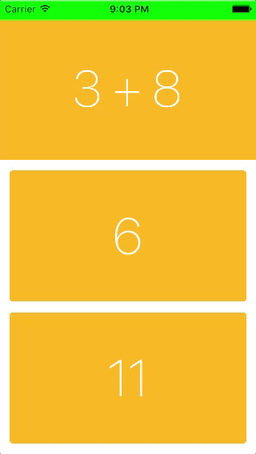
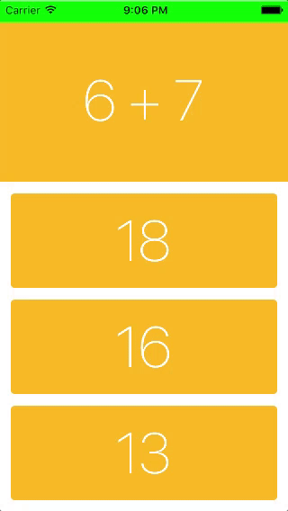
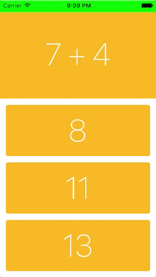

# DraftHypa02
Игра-тренажер для счёта (+, -, x, ÷) c настройкой длительности и сложности заданий. Swipe вправо по правильному ответу увеличивает счет.

Swipe влево позволяет пропустить ход. После n-го количества пропусков предлагается добавить их еще.

При касании на вопрос можно поменять тип арифметической операции.

## About implementation

Сторонние библиотеки не используются.

CardsViewController – root view controller.
View главного экрана задаётся программно в классе Cards, все остальные экраны задаются в Interface Builder.

Арифметические задания создаются в классе Task. За сложность задания (capacity) отвечает переменная rangeOfSummands, содержащая диапазон чисел, из которых создаются слагаемые выражения. Сложность задания меняется через каждые 5 шагов и задаётся в переменной numberOfStepsToChangeRange.

Классы Score, Passes, Time – синглтоны, отвечающие в игре за счет, пропуски ходов и время соответственно.
